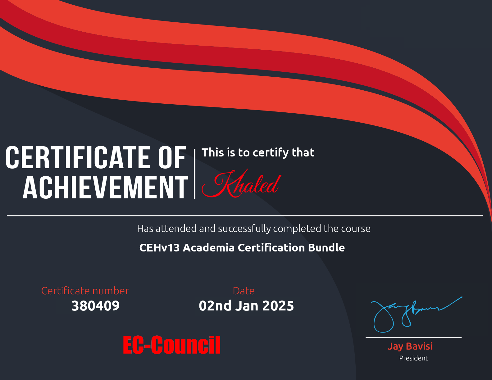

# Professional Credentials & Certifications

This repository serves as a centralized archive for my academic degrees, diplomas, and professional certifications.

## 🎓 Academic Qualifications

| Institution | Degree / Program | Status |
| :--- | :--- | :--- |
| **Davenport University** | B.Sc. in Cyber Defense | Completed |
| **Fanshawe College** | Advanced Diploma | Completed |

---

## 🏅 Professional Certifications

### Certified Ethical Hacker (CEH v13)

### CompTIA Security+

